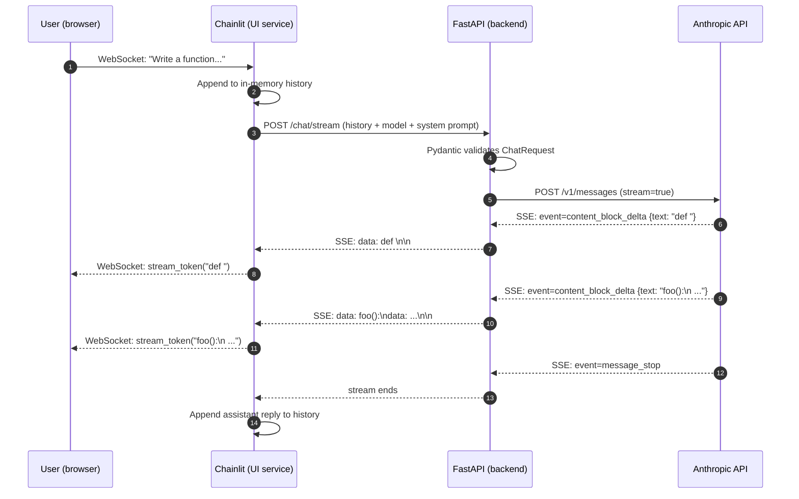

# AI Chat API

A streaming chat application built with **FastAPI** and **Chainlit** that talks to **Anthropic's Claude** models. Type a message in the browser; tokens stream back as Claude generates them, end-to-end async, no polling.

This repo is a minimal-but-real reference for how to wire up a streaming LLM chat app: a thin backend that proxies Anthropic, a UI service that consumes the backend over Server-Sent Events, and Docker Compose to run both together.

---

## Table of contents

- [What it does](#what-it-does)
- [Tech stack](#tech-stack)
- [Architecture](#architecture)
- [Request workflow](#request-workflow)
- [Project structure](#project-structure)
- [Prerequisites](#prerequisites)
- [Quick start (Docker)](#quick-start-docker)
- [Local development (no Docker)](#local-development-no-docker)
- [Configuration](#configuration)
- [API reference](#api-reference)
- [Sharing with someone over the internet](#sharing-with-someone-over-the-internet)
- [Troubleshooting](#troubleshooting)
- [Design notes](#design-notes)

---

## What it does

- Accepts user messages plus an optional system prompt.
- Sends the conversation to the **Anthropic Messages API** with `stream=true`.
- Re-streams each text delta to the client as a **Server-Sent Events (SSE)** response.
- Renders the live stream inside a **Chainlit** chat UI, preserving multi-line content (code blocks, indentation) intact.
- Keeps per-session conversation history in the UI so follow-up questions have context.

It is intentionally small (~360 lines of Python total) so the streaming machinery is easy to read end-to-end.

---

## Tech stack

| Layer | Choice | Why |
|---|---|---|
| Language | Python 3.12 | Slim image, async-first |
| Web framework | FastAPI | Async, automatic OpenAPI docs |
| ASGI server | Uvicorn (`[standard]`) | Production-grade event loop + websockets |
| HTTP client | httpx (`AsyncClient`) | Async + HTTP/2 + connection pooling |
| Validation | Pydantic v1/v2 | Request/response models for `/chat/stream` |
| Env loading | python-dotenv | Reads `.env` for local dev |
| UI | Chainlit | Drop-in chat UI with WebSocket streaming |
| LLM | Anthropic Messages API (Claude) | Native streaming SSE |
| Packaging | Docker + Docker Compose | One-command boot for both services |
| Sharing | Cloudflare Tunnel / ngrok (optional) | Expose locally-running app to a friend |

---

## Architecture

Two containers, one Docker network:

```
+-----------------------------+         +------------------------------+         +---------------------+
|   Browser (your friend)     |  HTTP   |   chainlit_ui container      |  HTTP   |   backend container |
|                             | <-----> |   (Chainlit on :8001)        | <-----> |   (FastAPI on :8000)|
|   localhost:8001            |   WS    |                              |   SSE   |                     |
+-----------------------------+         +------------------------------+         +---------------------+
                                                                                          |
                                                                                          | HTTPS (SSE)
                                                                                          v
                                                                              api.anthropic.com/v1/messages
```

- The **browser** only ever talks to Chainlit. There is no cross-origin call from the browser to FastAPI — that's why there's no CORS middleware.
- **Chainlit** talks to the FastAPI backend over the internal Docker network (`http://backend:8000`).
- **FastAPI** talks to Anthropic over the public internet using a long-lived `httpx.AsyncClient` so TCP/TLS connections are kept warm between requests.

---

## Request workflow

What happens when you type a message and hit enter:



Two correctness details that took a couple of bug-fix passes to get right:

1. **Multi-line tokens.** Anthropic frequently emits a single text delta containing `\n` (e.g. mid-code-block). The SSE spec says you must emit one `data:` line per line of payload. The encoder in `routers/chat.py` does that; the decoder in `chainlit_ui/app.py` buffers `data:` lines until the blank-line terminator and joins them with `\n`.
2. **Meaningful leading spaces.** Anthropic streams tokens like `" world"`. SSE format adds one space after `data:`, which the spec says to strip — but only one. A naive `.strip()` on the receiver eats the leading space of the real token. The decoder strips exactly one space.

---

## Project structure

```
project1-ai-chat-api/
├── main.py                  # FastAPI app + lifespan (closes shared HTTP client)
├── routers/
│   └── chat.py              # POST /chat/stream — async SSE endpoint
├── schemas/
│   └── chat.py              # Pydantic models: ChatMessage, ChatRequest, ChatError
├── services/
│   └── llm.py               # Async Anthropic Messages streaming client
├── requirements.txt         # Backend deps: fastapi, uvicorn, httpx, python-dotenv
├── Dockerfile               # Backend container image (python:3.12-slim)
├── chainlit_ui/
│   ├── app.py               # Chainlit handlers + SSE parser
│   ├── chainlit.md          # Welcome screen content
│   ├── requirements.txt     # UI deps: chainlit, httpx
│   ├── Dockerfile           # UI container image
│   └── .dockerignore
├── docker-compose.yml       # Wires backend + ui together
├── .env.example             # Template for required env vars
├── .gitignore               # Blocks .env, .venv, __pycache__, .chainlit, etc.
├── .dockerignore            # Keeps build context small
└── README.md
```

---

## Prerequisites

- **Docker Desktop** (or Docker Engine + Compose plugin) running on your machine.
- An **Anthropic API key** — sign up at [console.anthropic.com](https://console.anthropic.com) and create one under Settings → API Keys.

For non-Docker local dev you'll also need **Python 3.10+**.

---

## Quick start (Docker)

```bash
# 1. Clone the repo
git clone https://github.com/vinayvvk527/ai-projects-26.git
cd ai-projects-26

# 2. Create your .env from the template
cp .env.example .env
# Open .env in any editor and set ANTHROPIC_API_KEY=sk-ant-...

# 3. Boot both services
docker compose up --build
```

Open the UI: **http://127.0.0.1:8001**

Other endpoints (helpful for debugging):
- Backend health: http://127.0.0.1:8000/health
- Interactive API docs (Swagger): http://127.0.0.1:8000/docs

To stop:

```bash
docker compose down
```

To rebuild after you change Python code:

```bash
docker compose up --build
```

---

## Local development (no Docker)

Run the two services in separate terminals:

**Terminal 1 — backend**

```bash
python3 -m pip install -r requirements.txt
uvicorn main:app --reload --port 8000
```

**Terminal 2 — Chainlit UI**

```bash
python3 -m pip install -r chainlit_ui/requirements.txt
BACKEND_URL=http://127.0.0.1:8000 chainlit run chainlit_ui/app.py --port 8001
```

`--reload` on uvicorn auto-restarts the backend on file changes; Chainlit auto-reloads its own files.

---

## Configuration

All configuration is via environment variables. Backend reads from `.env` (mounted into the container by `docker compose`); the UI reads from its `environment:` block in `docker-compose.yml`.

### Backend (`.env`)

| Variable | Required | Default | Notes |
|---|---|---|---|
| `ANTHROPIC_API_KEY` | yes | — | Backend refuses to start without it. |
| `ANTHROPIC_DEFAULT_MODEL` | no | `claude-sonnet-4-5` | Used when the request body doesn't specify a Claude model. |

### Chainlit UI (`docker-compose.yml`)

| Variable | Default | Notes |
|---|---|---|
| `BACKEND_URL` | `http://127.0.0.1:8000` | Compose overrides this to `http://backend:8000` so the UI hits the backend over the internal Docker network. |
| `CHAT_MODEL` | `claude-sonnet-4-5` | What the UI puts in the `model` field of each request. |
| `CHAT_SYSTEM_PROMPT` | `You are a helpful assistant.` | Prepended as a system message. |
| `CHAT_TEMPERATURE` | `0.7` | Float, 0.0–2.0. |
| `CHAT_MAX_TOKENS` | `1000` | Max tokens per assistant turn. |

To change any of these, edit `docker-compose.yml` and `docker compose up` again — no rebuild needed.

---

## API reference

### `GET /health`

Liveness probe. Returns:

```json
{"status": "ok", "project": "AI Chat API"}
```

### `POST /chat/stream`

Streams an Anthropic chat completion back as `text/event-stream`.

**Request body**

```json
{
  "model": "claude-sonnet-4-5",
  "system_prompt": "You are a helpful assistant.",
  "temperature": 0.7,
  "max_tokens": 1000,
  "messages": [
    {"role": "user", "content": "Hello!"}
  ]
}
```

`model`, `system_prompt`, `temperature`, and `max_tokens` are optional and have the defaults shown above. `messages` is required and must contain at least one entry. Each message has `role` ∈ `{user, assistant, system}` and a non-empty `content`.

**Response**

`Content-Type: text/event-stream`. Each event is one or more `data:` lines followed by a blank line. Concatenating each event's payloads in order (joined by `\n` across `data:` lines) reconstructs the model's reply verbatim. If the backend hits an error mid-stream, it sends a single event whose payload starts with `[ERROR]`.

**Try it with curl**

```bash
curl -N -X POST http://127.0.0.1:8000/chat/stream \
  -H "Content-Type: application/json" \
  -d '{
    "model": "claude-sonnet-4-5",
    "messages": [{"role": "user", "content": "Say hello in one sentence."}]
  }'
```

The `-N` flag disables curl's output buffering so you see the stream as it arrives.

Full interactive docs (auto-generated from the Pydantic models): http://127.0.0.1:8000/docs

---

## Sharing with someone over the internet

You can let a friend on the other side of the world use your locally-running app **without deploying to the cloud**. Easiest path is a Cloudflare quick tunnel:

```bash
# In a second terminal, with `docker compose up` still running:
brew install cloudflared            # one-time
cloudflared tunnel --url http://localhost:8001
```

It prints a `https://<random>.trycloudflare.com` URL. Send that to your friend; she opens it in a browser and sees your Chainlit UI. Ctrl-C the tunnel to take it down.

Caveats:
- Your laptop must stay on and connected with `docker compose up` running.
- Anyone with the URL can use it — and each message hits Claude on **your** API key.
- For a private alternative (friend-only access), use [Tailscale](https://tailscale.com/) — install on both machines, sign in, then point her at `http://<your-tailscale-host>:8001`.

---

## Troubleshooting

**`ANTHROPIC_API_KEY must be set` on backend boot.** You either forgot to create `.env` from `.env.example`, or the key is empty. `docker compose down && docker compose up --build` after fixing.

**Chainlit shows `error: Anthropic API error 401`.** The key is wrong or revoked. Double-check the key in `.env`, restart with `docker compose up --build`.

**Chainlit shows `error: Anthropic API error 404 ... model: ...`.** The model id in `CHAT_MODEL` (or `ANTHROPIC_DEFAULT_MODEL`) isn't enabled on your account. Try `claude-haiku-4-5` or check your Anthropic console for available model ids.

**Output looks garbled / code blocks are mashed together.** You're running an old image. Rebuild: `docker compose down && docker compose up --build`. The current code handles multi-line SSE payloads correctly.

**Port already in use.** Something else is on 8000 or 8001. Change the host-side port mapping in `docker-compose.yml`, e.g. `"9000:8000"` for the backend, then hit `http://127.0.0.1:9000`.

**Hot-reloading on Mac with Docker is slow.** Use the no-Docker local dev path above — `uvicorn --reload` and Chainlit's built-in reloader are much snappier than rebuilding the image.

---

## Design notes

- **Async end-to-end.** `/chat/stream` is an `async` route returning an `async` generator, and `services/llm.py` uses `httpx.AsyncClient` instead of `requests`. One thread can serve many concurrent streams; no per-request threadpool bridge.
- **Shared HTTP clients.** Both the backend (talking to Anthropic) and the UI (talking to the backend) construct one `httpx.AsyncClient` per process and reuse it for the lifetime of the app. Keeps TCP + TLS sessions warm, which shaves real latency off the first token of every request after the first one.
- **Lifespan cleanup.** `main.py` uses FastAPI's `lifespan` context manager to close the Anthropic HTTP client cleanly on shutdown.
- **Spec-correct SSE on both sides.** Multi-line payloads get one `data:` line each on the wire; the receiver buffers them per event and joins on the blank-line terminator. Leading spaces are handled per the SSE spec (strip exactly one).
- **History rollback on error.** If the stream fails mid-reply, the Chainlit UI removes the user's just-sent message from history so a retry doesn't end up with a half-complete conversation in the context window.
- **No CORS middleware.** The browser only talks to Chainlit; Chainlit's server makes the backend call. So no cross-origin requests are involved.
- **Slim images.** Backend image carries only FastAPI, Uvicorn, httpx, and python-dotenv — no `torch`, no `transformers`, no `openai` SDK. The UI image is heavier (Chainlit pulls in a React-built frontend), but unavoidable.

---

## License

This repo is provided as-is for learning and personal use.
